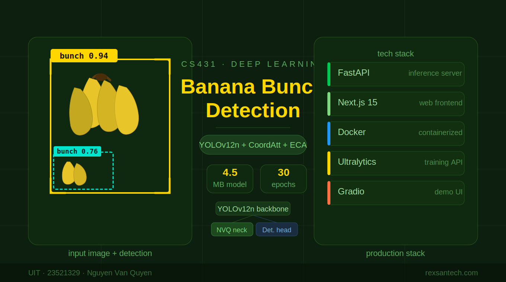
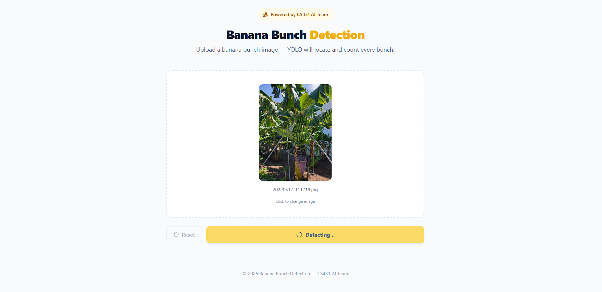
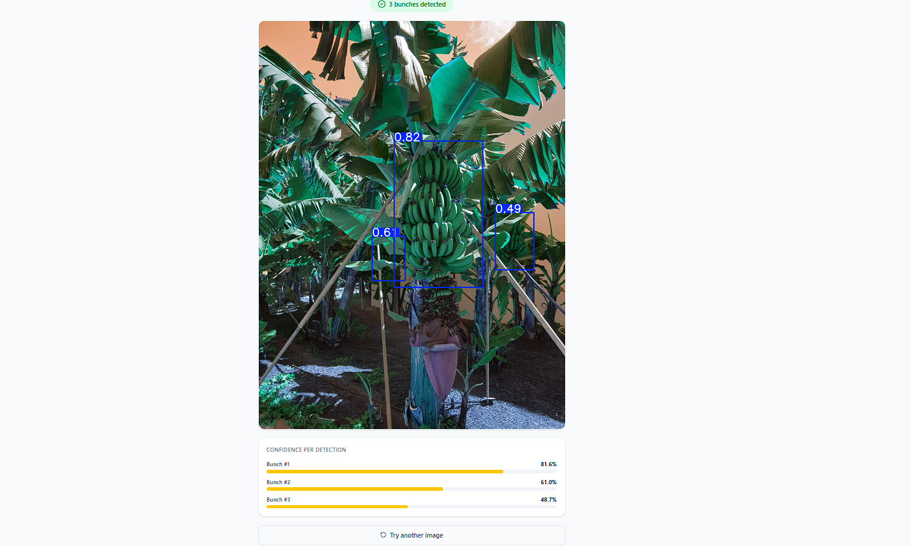
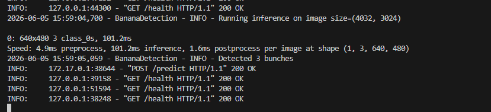

<p align="center">
  <a href="https://www.uit.edu.vn/" title="University of Information Technology" style="border: none;">
    
  </a>
</p>

<h1 align="center"><b>CS431 - Deep Learning</b></h1>

# **Banana Bunch Detection**

An end-to-end object detection system for automatically identifying and counting banana bunches in images. Built on a custom-enhanced **YOLOv12n** architecture augmented with Coordinate Attention and Efficient Channel Attention mechanisms, the system delivers fast, accurate inference through a production-ready stack.

- Ultra-lightweight custom YOLOv12n model (4.5 MB) enhanced with novel attention modules
- Real-time REST API powered by FastAPI with structured health-check and prediction endpoints
- Responsive Next.js 15 / React 19 web UI with drag-and-drop upload and annotated results
- Fully containerized Docker deployment with optional Cloudflare Tunnel for public access
- Alternative Gradio demo interface for quick local experimentation

<p align="center">
  
</p>

> **Report:** [placeholder — full technical report will be linked here once published]
---

## 👥 Group information

| STT | Student ID | Full Name | Role | Github | Email |
| --- | --- | --- | --- | --- | --- |
| 1 | 23521329 | Nguyễn Văn Quyền | Developer | [quyen244](https://github.com/quyen244) | 23521329@gm.uit.edu.vn |

---

## Table of Contents

1. [Project Overview](#project-overview)
2. [Key Features](#key-features)
3. [Tech Stack / Architecture](#tech-stack--architecture)
4. [Dataset](#dataset)
5. [Methodology / Approach](#methodology--approach)
6. [Project Structure](#project-structure)
7. [Installation & Setup](#installation--setup)
8. [Usage](#usage)
9. [Demo](#demo)
10. [Results / Evaluation](#results--evaluation)
11. [Deployment](#deployment)
12. [References](#references)

---

## Project Overview

Counting banana bunches manually during harvest or quality-control is labor-intensive and error-prone. This project automates that task using a custom object detection model trained specifically on banana bunch imagery.

The pipeline covers:
- **Custom model design** — YOLOv12n backbone extended with depthwise convolution blocks (DCPBlock), coordinate attention (CoordAtt), efficient channel attention (ECA), and a novel quad residual block (NVQ).
- **Training** — 30 epochs on a labeled banana dataset with extensive color and photometric augmentation to handle real-world lighting variation.
- **Serving** — FastAPI backend that accepts image uploads and returns a bounding-box-annotated result alongside per-detection confidence scores.
- **Web UI** — Next.js frontend providing a clean drag-and-drop interface, live image preview, and structured results display.
- **Deployment** — Single Docker container (CPU-only, ~python:3.11-slim) orchestrated with a shell script and optionally exposed via Cloudflare Tunnel at `https://rexsantech.com`.

---

## Key Features

### Custom Attention-Enhanced YOLOv12n
- **CoordAtt (Coordinate Attention)** — Captures long-range spatial dependencies along both height and width axes independently, improving localization of banana bunches at different orientations and scales.
- **ECA (Efficient Channel Attention)** — Lightweight 1-D convolution over channel-averaged features to recalibrate channel responses without fully connected layers.
- **DCPBlock (Depthwise Convolution Block)** — Combines 3×3 and 7×7 depthwise convolutions with CoordAtt and a pointwise projection, enabling multi-scale feature extraction with minimal parameter overhead.
- **NVQ Block** — Cascades multiple DCPBlocks with ECA-weighted skip connections in a C2F-style architecture, forming the core novel building block of the detection neck.

### FastAPI Inference Server
- `POST /predict` — Accepts multipart image uploads; returns JSON with `bunch_count`, `confidences[]`, and a base64-encoded annotated JPEG.
- `GET /health` — Liveness probe used by Docker health-check and deployment scripts.
- CORS enabled for all origins; custom module injection ensures correct deserialization of the custom model architecture.

### Next.js Web Interface
- Drag-and-drop or click-to-upload image input.
- Instant image preview before submission.
- Post-detection display: annotated bounding-box image + per-detection confidence bars.
- Yellow banana-themed color palette; fully responsive for mobile and desktop.

### Gradio Demo (`app.py`)
- Minimal single-file Gradio interface for local testing without the full frontend stack.
- Loads the same `ultimate_model.pt` with identical inference settings.

### Containerized Deployment
- `Dockerfile` builds a CPU-only Python 3.11 image with OpenCV system dependencies.
- `run_server.sh` / `stop_server.sh` manage the Docker lifecycle and optionally launch a Cloudflare Tunnel.

---

## Tech Stack / Architecture

| Layer | Technology |
|---|---|
| Detection Model | YOLOv12n (custom architecture) via Ultralytics |
| Model Training | Ultralytics YOLO training API, Kaggle GPU environment |
| Inference Backend | Python 3.11, FastAPI, Uvicorn, Pillow, OpenCV (headless), NumPy |
| Web Frontend | Next.js 15.3.2, React 19, TypeScript, Tailwind CSS 4, Lucide icons |
| Containerization | Docker (python:3.11-slim, CPU-only PyTorch) |
| Tunneling | Cloudflare Tunnel (`cloudflared`) |
| Alt. Demo UI | Gradio |

### System Architecture

```
User Browser
    │  HTTP / HTTPS
    ▼
Next.js Frontend  ──►  POST /predict  ──►  FastAPI Backend
  (port 3000)                               (port 8000)
                                                │
                                       Load model: ultimate_model.pt
                                       (YOLOv12n + custom modules)
                                                │
                                       Return: bunch_count, confidences,
                                               annotated_image (base64)
```

When deployed with Docker + Cloudflare Tunnel the backend is publicly reachable at `https://rexsantech.com`.

---

## Dataset

| Property | Detail |
|---|---|
| Task | Object Detection |
| Classes | 1 — `banana bunch` |
| Native resolution | ~4000 × 3000 (variable, high-resolution field photos) |
| Training input size | 640 × 640 (resized during preprocessing) |
| Annotation format | YOLO (normalized bounding boxes) |
| Source | Kaggle (referenced as `/kaggle/input/final-model`) |
| Sample images | 4 real-world field photos in `images/` |

Raw images are captured at high resolution (~4000×3000) reflecting real harvest conditions. During training and inference they are resized to 640×640 — YOLO's standard input resolution — which both standardizes feature scale and significantly reduces memory and compute requirements without meaningful loss of detection accuracy for this task.

---

## Methodology / Approach

### Model Architecture

The base **YOLOv12n** (nano) detection architecture is augmented at the neck/head with custom modules:

```
Input Image (640×640)
        │
   YOLOv12n Backbone
        │
   NVQ Neck Blocks
   ┌────────────────────────────────────────────┐
   │  ECA(input)  → DCPBlock × n → residual add │
   │  DCPBlock = DW-3×3 + DW-7×7 + CoordAtt     │
   │                + pointwise conv             │
   └────────────────────────────────────────────┘
        │
   Detection Head → Bounding Boxes + Confidence
```

**Activation functions**: Hard-sigmoid (`relu(x+3)/6`) and Hard-swish (`x · h_sigmoid(x)`) are used throughout the custom modules for mobile-friendly inference.

### Training Configuration

| Hyperparameter | Value |
|---|---|
| Epochs | 30 |
| Batch size | 32 |
| Input size | 640 × 640 |
| Optimizer | Auto (Ultralytics default) |
| Box loss weight | 7.5 |
| Classification loss weight | 0.5 |
| DFL loss weight | 1.5 |
| Mosaic augmentation | 1.0 |
| Horizontal flip | 0.5 |
| Scale jitter | 0.5 |
| Translation | 0.1 |

**Photometric augmentation**: RandomBrightnessContrast (p=0.5), RandomGamma (p=0.4), CLAHE (p=0.2), HueSaturationValue (p=0.3), RandomShadow (p=0.3) — chosen to make the model robust to the wide variety of lighting encountered in field conditions.

### Inference Parameters

| Parameter | Value |
|---|---|
| Confidence threshold | 0.4 |
| IoU threshold (NMS) | 0.5 |
| Max detections | 100 |

### Evaluation Methodology (mAP @ IoU 0.5)

```
For each prediction:
  Compute IoU with ground-truth boxes
       │
  IoU ≥ 0.5  →  True Positive (TP)
  IoU < 0.5  →  False Positive (FP)
  Missed GT  →  False Negative (FN)
       │
  Vary confidence threshold → Precision-Recall curve
       │
  Area under PR curve → Average Precision (AP) per class
       │
  Mean over all classes → mAP
```

---

## Project Structure

```
bunch-banana-detection/
├── app.py                      # Gradio demo (single-file alternative UI)
├── requirements.txt            # Python dependencies
├── Dockerfile                  # CPU-only Docker image definition
├── run_server.sh               # Start Docker container + Cloudflare Tunnel
├── stop_server.sh              # Stop running Docker container
│
├── backend/
│   ├── __init__.py
│   └── main.py                 # FastAPI app: /health + /predict endpoints
│
├── frontend/
│   ├── src/app/
│   │   ├── page.tsx            # Main detection UI (drag-drop, results)
│   │   ├── layout.tsx          # Root layout and metadata
│   │   └── globals.css         # Tailwind global styles
│   ├── package.json
│   ├── next.config.ts
│   ├── tsconfig.json
│   └── .env.example            # NEXT_PUBLIC_BACKEND_URL configuration
│
├── models/
│   ├── ultimate_model.pt       # Trained YOLOv12n weights (4.5 MB)
│   └── args (1).yaml           # Training hyperparameters record
│
├── images/                     # Sample banana bunch test images
└── logs/                       # Runtime deployment logs
```

---

## Installation & Setup

### Prerequisites

- Python 3.11+
- Node.js 18+ and npm
- Docker (for containerized deployment)
- `cloudflared` CLI (optional, for public tunnel)

### Backend (local)

```bash
# Clone the repository
git clone <repo-url>
cd bunch-banana-detection

# Install Python dependencies
pip install -r requirements.txt

# Start the FastAPI server
uvicorn backend.main:app --host 0.0.0.0 --port 8000
```

### Frontend (local)

```bash
cd frontend

# Install dependencies
npm install

# Configure backend URL
cp .env.example .env.local
# Edit .env.local: NEXT_PUBLIC_BACKEND_URL=http://localhost:8000

# Start development server
npm run dev
```

Open `http://localhost:3000` in your browser.

### Docker deployment

```bash
# Make scripts executable (Linux/macOS)
chmod +x run_server.sh stop_server.sh

# Start backend container (+ optional Cloudflare Tunnel)
./run_server.sh

# Stop
./stop_server.sh
```

The script automatically:
1. Verifies `models/ultimate_model.pt` exists.
2. Builds and runs the Docker container on port 8000.
3. Polls `/health` until the API is ready (up to 90 s).
4. Launches `cloudflared tunnel` if installed.

### Alternative — Gradio demo

```bash
pip install -r requirements.txt gradio
python app.py
```

---

## Usage

### Web UI

1. Navigate to the frontend (local `http://localhost:3000` or `https://rexsantech.com`).
2. Drag and drop a banana image onto the upload area, or click to browse.
3. Click **Detect Bunches**.
4. View the annotated image with bounding boxes, the total bunch count, and per-detection confidence scores.

### REST API

```bash
# Health check
curl http://localhost:8000/health

# Predict (returns JSON)
curl -X POST http://localhost:8000/predict \
  -F "file=@images/20220517_111719.jpg"
```

**Response schema:**
```json
{
  "bunch_count": 3,
  "confidences": [0.94, 0.88, 0.76],
  "annotated_image": "<base64-encoded JPEG>"
}
```

---

## Results / Evaluation

The model is evaluated using **mAP @ IoU 0.5**, the standard metric for single-class detection tasks. The PR-curve workflow is:

1. Run inference across all validation images.
2. Match predictions to ground-truth boxes using IoU ≥ 0.5.
3. Sweep the confidence threshold to generate the full Precision–Recall curve.
4. Compute the area under the curve (Average Precision).

Training was conducted on Kaggle with GPU acceleration for 30 epochs. The final `ultimate_model.pt` (4.5 MB) is a YOLOv12n nano model optimized for CPU inference and edge deployment.

### Quantitative Comparison

**Table 2:** Quantitative comparison across models on the banana bunch test set. **Bold** values indicate the best performance for each metric. ↓ lower-is-better; ↑ higher-is-better.

| Metric | YOLOv12n | **Ours (V2Q2F)** | YOLOv12s | YOLOv12m |
|---|---|---|---|---|
| Params (M) ↓ | 2.5 | **2.2** | 9.2 | 20.0 |
| FLOPs (G) ↓ | 6.5 | **5.6** | 21.2 | 67.7 |
| Precision (%) ↑ | 91.0 | **94.5** | 93.8 | 93.1 |
| Recall (%) ↑ | 89.0 | **91.6** | 88.0 | 89.6 |
| mAP@0.5 (%) ↑ | 92.0 | **96.1** | 95.3 | 95.9 |
| mAP@0.5:0.95 (%) ↑ | 53.0 | **58.7** | 57.9 | 58.3 |

**Efficiency.** V2Q2F reduces trainable parameters from 2.5M to 2.2M (a 12% reduction) while simultaneously achieving the highest scores across all detection metrics — outperforming both larger models (YOLOv12s at 9.2M params, YOLOv12m at 20.0M params) and the baseline YOLOv12n. This validates the effectiveness of the custom attention-enhanced modules (CoordAtt, ECA, DCPBlock, NVQ) in replacing capacity with inductive bias.

---

## Demo

> **Note on latency:** Raw images are ~4000×3000 and must be transferred to a remote backend for inference. Two deployment options are available with different latency profiles.

### 3.1 Hugging Face Space (fast)

The model is also hosted on Hugging Face Spaces backed by a foreign (cloud) server. Cold-start aside, inference is noticeably faster than the self-hosted option due to higher-bandwidth infrastructure.


<p align="center">
  <video controls width="700">
  <source src="artifacts/huggingface_demo.mp4" type="video/mp4">
</video>
</p>


### 3.2 Self-hosted server (via Cloudflare Tunnel)

Requests route through Cloudflare's edge → Cloudflare Tunnel → local server, adding meaningful round-trip latency on top of inference time. This is the expected behavior for a home-lab deployment.

**Interface:**

<p align="center">
  
</p>

**Visualization of detection results:**

<p align="center">
  
</p>

**Backend JSON response:**

<p align="center">
  
</p>

---

## Deployment

| Component | URL |
|---|---|
| Frontend (Vercel) | https://bunch-banana-detection.vercel.app/ |
| Backend API | https://rexsantech.com |
| Predict endpoint | `POST https://rexsantech.com/predict` |

The frontend is deployed on Vercel (Next.js, zero-config CDN). The backend runs inside a Docker container on a local machine, exposed publicly via a Cloudflare Tunnel under the `rexsantech.com` domain.

```bash
# Live predict against the deployed backend
curl -X POST https://rexsantech.com/predict \
  -F "file=@your_image.jpg"
```

---

## References

- [Ultralytics YOLOv12](https://github.com/ultralytics/ultralytics)
- [Coordinate Attention for Efficient Mobile Network Design](https://arxiv.org/abs/2103.02907) — Hou et al., CVPR 2021
- [ECA-Net: Efficient Channel Attention for Deep Convolutional Neural Networks](https://arxiv.org/abs/1910.03151) — Wang et al., CVPR 2020
- [FastAPI](https://fastapi.tiangolo.com/)
- [Next.js](https://nextjs.org/)
- [Cloudflare Tunnel](https://developers.cloudflare.com/cloudflare-one/connections/connect-networks/)
